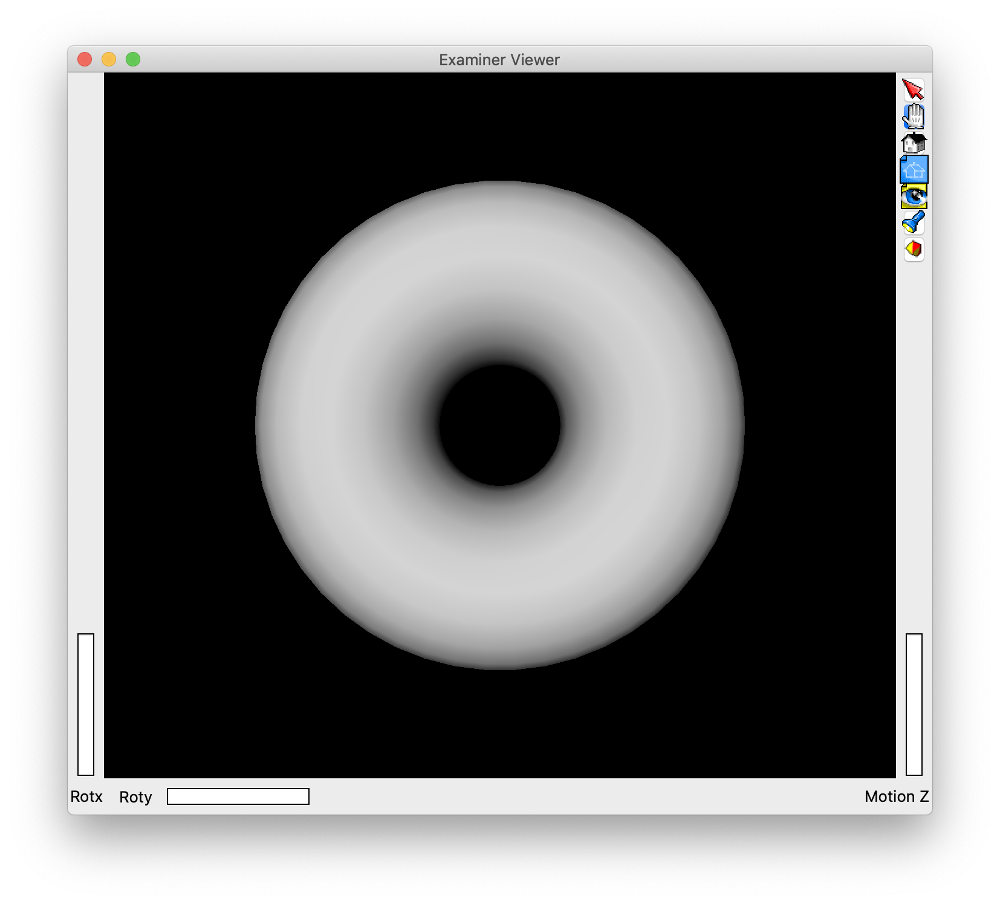
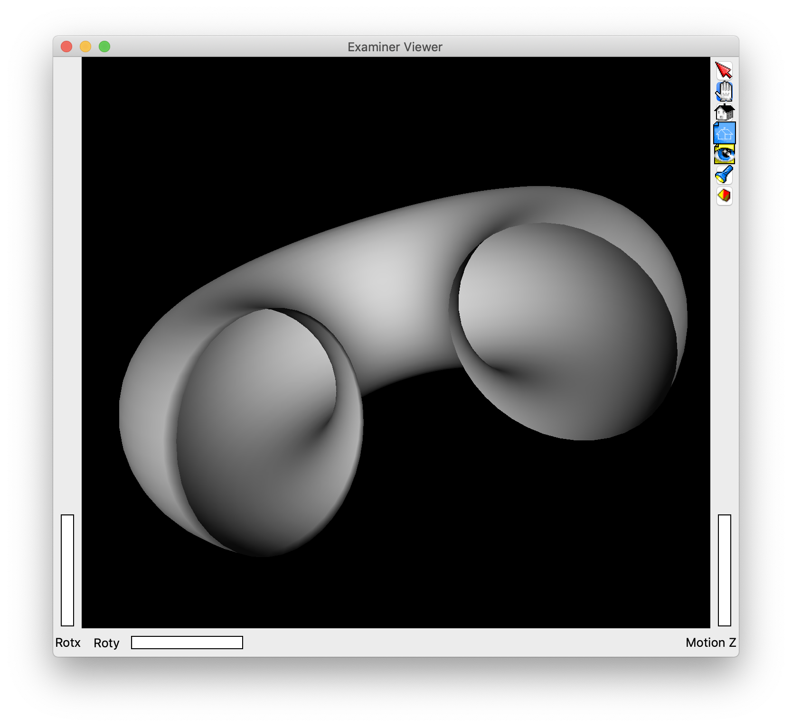
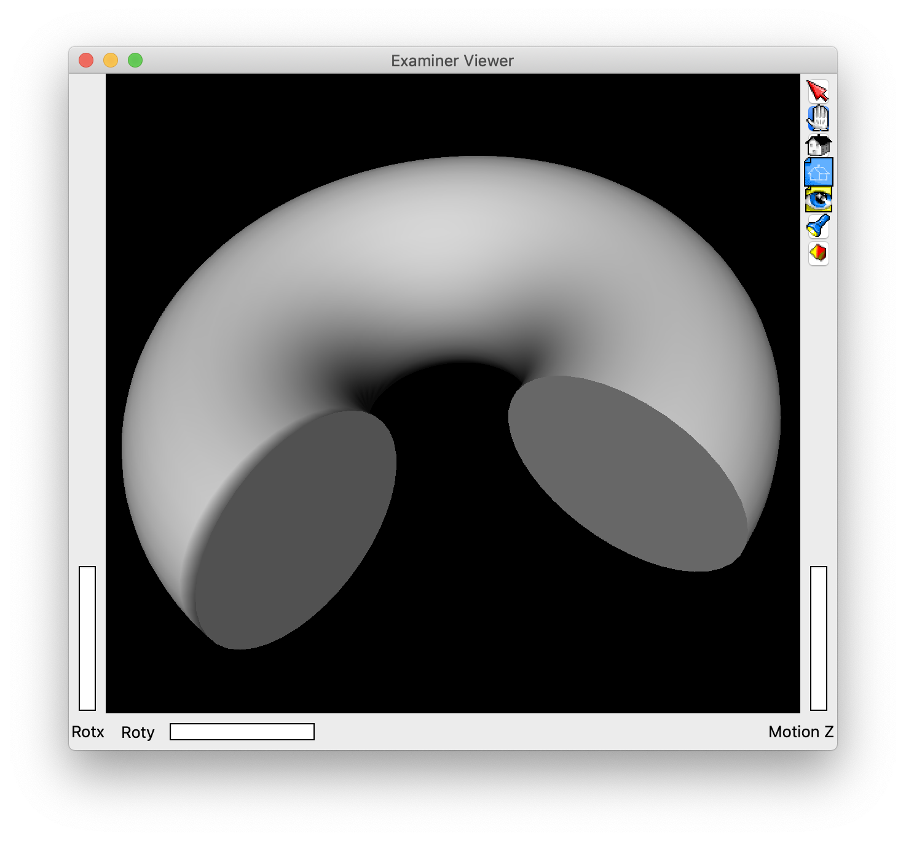
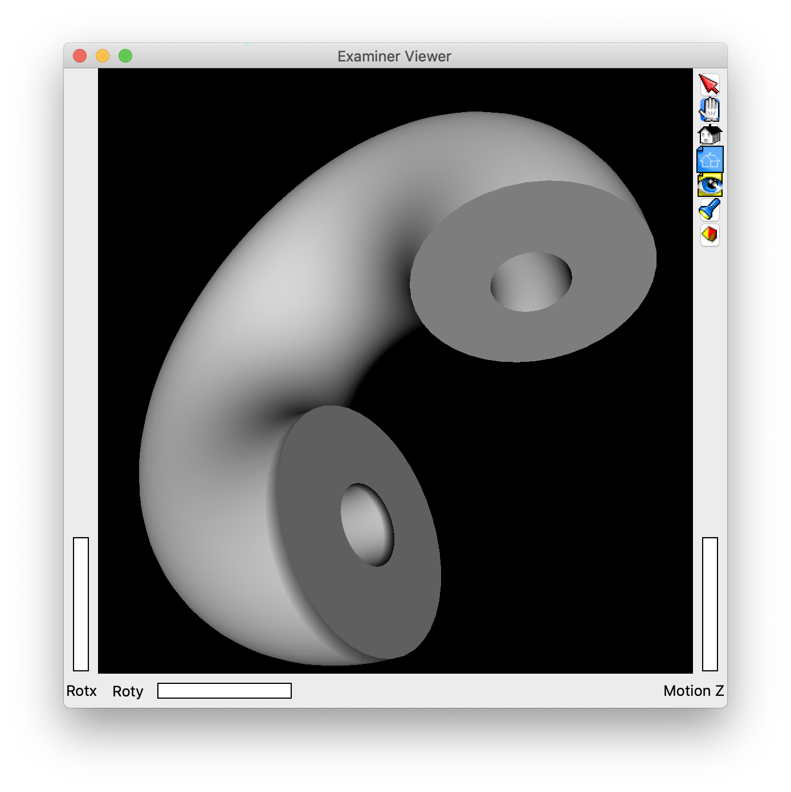
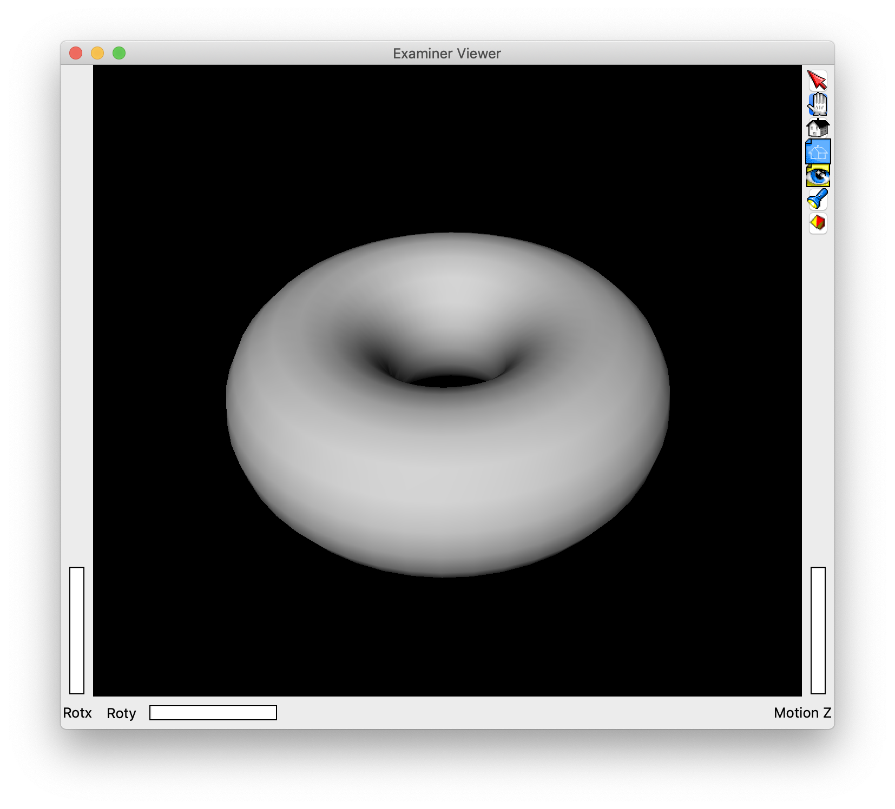
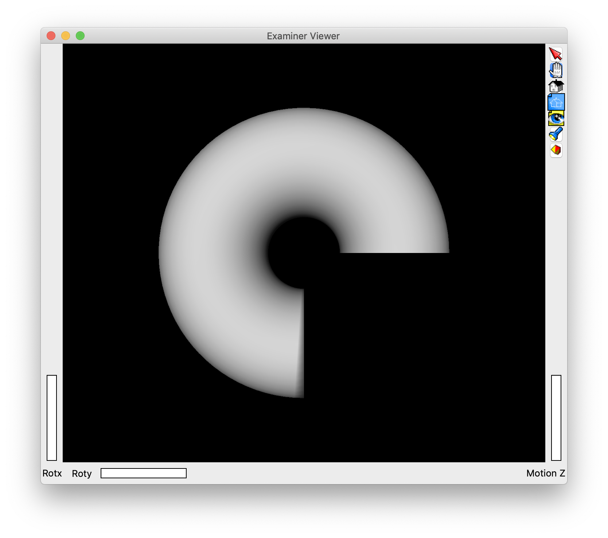

# Build a Torus shape

The example shows how to visualize a custom shape.

In particular, we define the visualization of a Torus shape, which is not defined as built-in shape in Coin/OpenInventor.

The Torus is defined by several parameters:

 - a major radius, `rTor`, which defines the main radius of the circular shape
 
 - a minor radius, `rXSec`, which defines the radius of the cross section of the torus, i.e., the outer radius of the "pipe"
 - an inner radius, `rInner`, which defines the inner radius of the "pipe". The value of this variable deeply affects the nature and the aspect of the torus:
   - if `rInner` is equal to `-1`, then the torus is made of a toroidal surface only, with no thickness, as shown in the figure below:
   
   - if `rInner` is equal to `0`, then the torus becomes a "solid torus", whose internal volume is completely filled, as shown in the figure below:
   
   - if `rInner` is greater than `0`, then the torus becomes a "pipe": it is hollow, with `rInner` defining the radius of the inner cavity; this is shown in the figure below:
   

